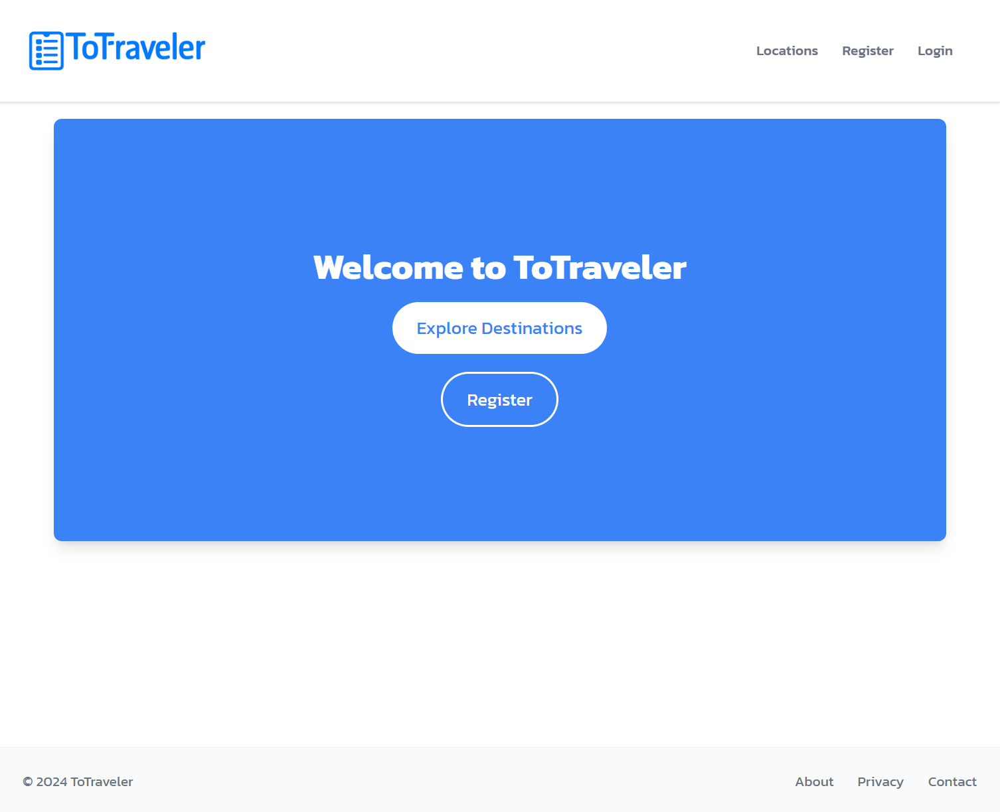
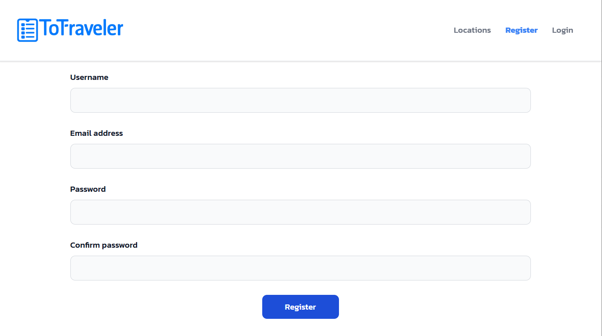
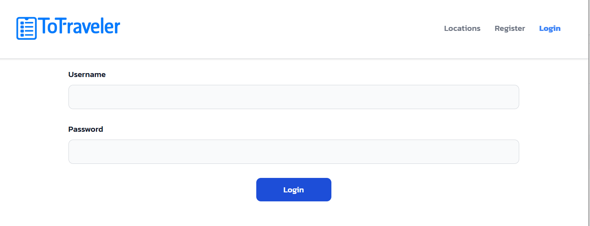
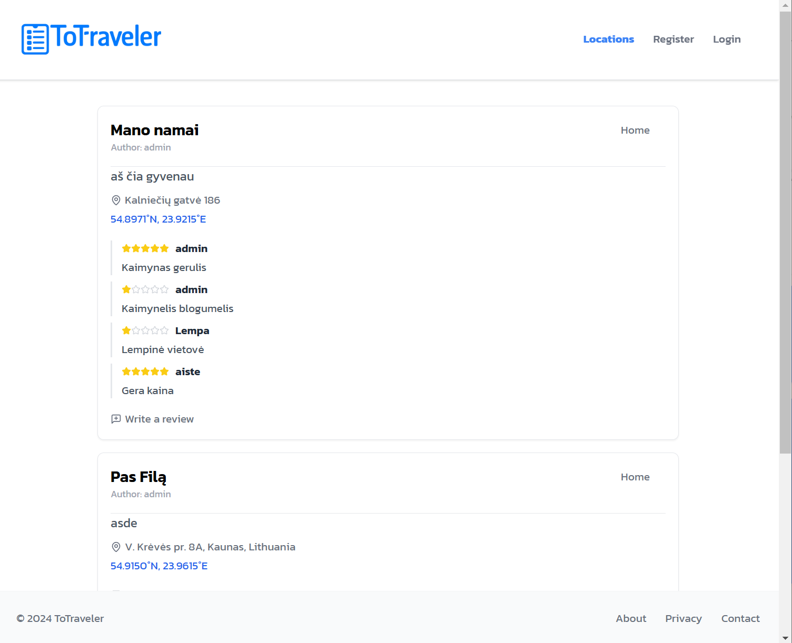
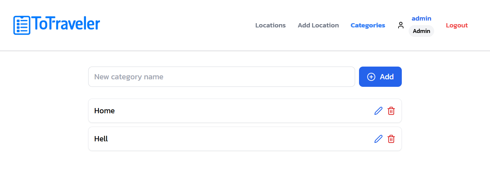
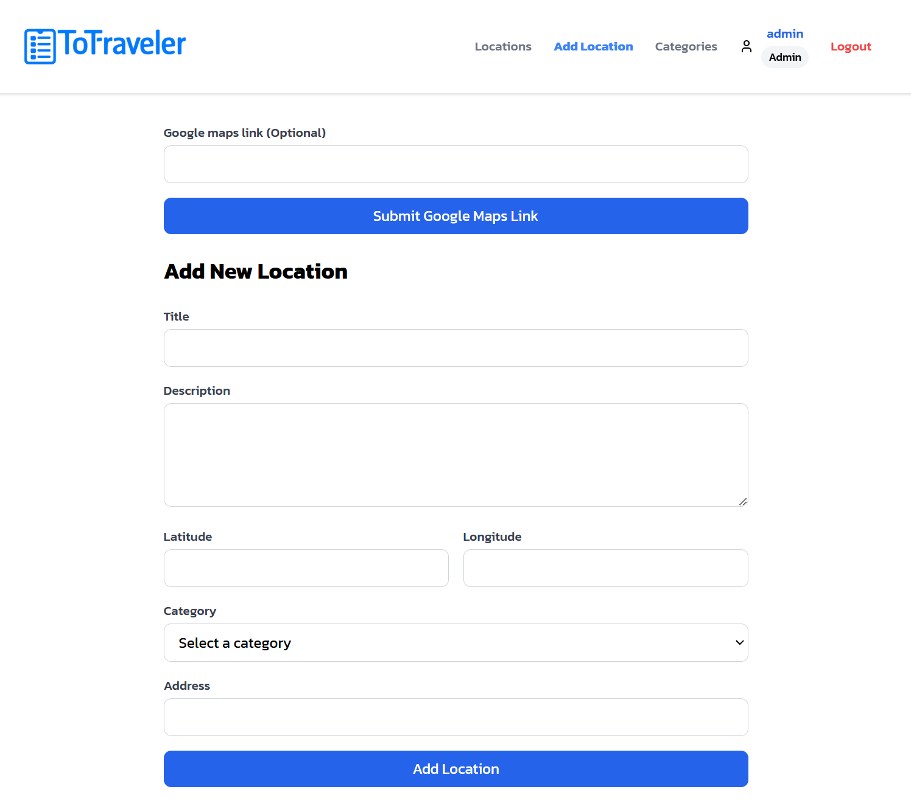
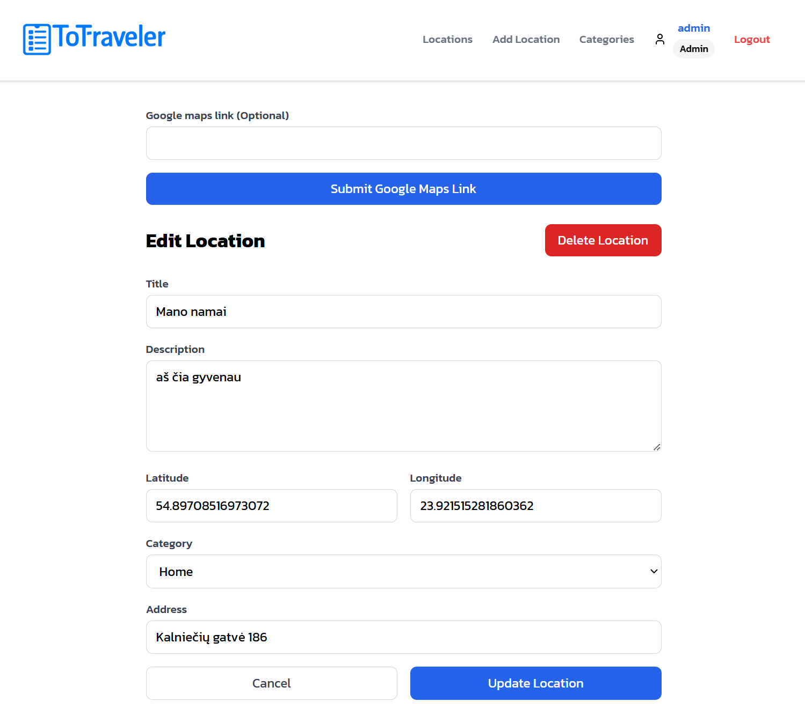

# ToTraveler
Vietovių pildymo ir jų vertinimo sistema.

Saitynas pasiekiamas per http://20.215.233.177/.

## Funkciniai reikalavimai
Use case diagrama:

## Sistemos architektūra 
UML deployment diagrama:

## Naudotojo sąsajos projektas
Kadangi projektas nedidelis, langų wireframe'ai nebuvo naudojami. Svetainę realizavau be wireframe'ų, reverse engineering (website to wireframe) nedariau. Esu naudojęs Figma su Photoshop frontend dizaino kūrimui. Suprantu jog susidėliot dideliai ir sudėtingai svetainei visą dizainą  su atitinkamais įrankiais yra dažnai paprasčiau ir pigiau negu jį suprogramuot.

### Pagrindinis puslapis

### Registracijos forma

### Prisijungimo forma

### Svečiui matomos lokacijos

### Tik administratoriui prieinamas kategorijų valdymo puslapis

### Lokacijų pridėjimo forma
Galima formą lengvai papildyti naudojant Google Maps nuorodą.

### Lokacijos redagavimo forma

## API specifikacija
API specifikacija pateikta [api-spec.yaml](/api-spec.yaml) su galimais response kodais, bet užklausų schemų pavyzdžiais.

## Išvados
- Projekto pradinė apimtis buvo per didelė modulio atžvilgiu, teko susiprastinti.
- Prisiminiau ir pagilinau RESTful API principus.
- Išmokau hostint sveitainę.
- Pirmas realizuotas projektas naudojat ReactJs kartu su Vite.

